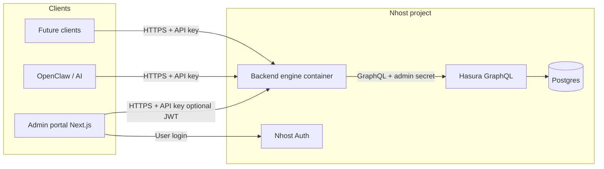

# Backend Engine Migration Plan

This document proposes extracting the Dropiti admin API from the Next.js monolith (`dropiti-admin-console-2`) into a dedicated **backend engine** service. The goal is to support commercialization, AI-driven control (e.g. OpenClaw), and deployment as an **Nhost Run**–compatible container while tightening security and preserving Hasura as the data layer.

**Related docs:** [API Guide](./api-guide.md), [Nhost Migration & Auth](./nhost-migration.md), [Admin Nhost Migration](./admin-nhost-migration.md).

---

## Table of Contents

1. [Executive summary](#executive-summary)
2. [Current state](#current-state)
3. [Target architecture](#target-architecture)
4. [Technology decisions](#technology-decisions)
5. [Security model](#security-model)
6. [Route migration map](#route-migration-map)
7. [OpenClaw integration](#openclaw-integration)
8. [Nhost Run deployment](#nhost-run-deployment)
9. [Migration phases](#migration-phases)
10. [Suggested project layout](#suggested-project-layout)
11. [Environment variables](#environment-variables)
12. [Testing strategy](#testing-strategy)
13. [Risks and follow-ups](#risks-and-follow-ups)

---

## Executive summary

Today, `/api/v1/*` is implemented as **Next.js App Router route handlers** in the same deployable as the admin UI. That coupling is fine for a single product but limits how you expose a **stable, versioned API** to multiple clients (admin portal, future products, AI agents).

The proposed backend engine:

- **Re-hosts the same REST surface** (paths and semantics aligned with v1) in a small HTTP server (recommended: **Hono** + **TypeScript**).
- **Talks to Hasura** the same way as today (GraphQL over HTTP with server-side admin secret); no ORM migration is required.
- **Runs in a Docker image** deployable via **[Nhost Run](https://docs.nhost.io/products/run/overview)** (custom container alongside your Nhost stack).
- **Protects access** with a **service API key** (and optionally Nhost JWT verification where user identity matters).
- **Exposes a machine-readable contract** (OpenAPI from Zod schemas) to make **OpenClaw** (or similar) integration predictable and safe.

---

## Current state

| Area | Today |
|------|--------|
| **Framework** | Next.js 15 (App Router); API = `route.ts` files under `src/app/api/v1/` |
| **Data** | Hasura GraphQL → Postgres; helpers such as `executeHasuraQuery()` in `src/app/api/v1/utils/hasuraServer.ts` |
| **Auth** | Nhost for sign-in; `jose` + `NHOST_JWT_SECRET` for JWT verification on **pages** via `middleware.ts`. API routes under `/api` are **not** gated by that middleware. |
| **v1 route auth** | `/api/v1/auth/*` enforces session and admin role; **most other v1 handlers** call Hasura with the **admin secret** and assume a trusted caller (same-origin admin app). |
| **Deploy** | Primarily **Netlify** (`netlify.toml`); no Dockerfile in-repo for the API layer. |
| **Documentation drift** | [API Guide](./api-guide.md) mentions some endpoints (e.g. chat, large `/api/v1/admin/*`) that are **not** present under `src/app/api/v1/` today. The migration should reconcile docs with the **implemented** route list below. |

**Inventory:** There are **49** `route.ts` modules under `src/app/api/v1/` (see [Route migration map](#route-migration-map)).

---

## Target architecture



**Principles:**

1. **Thin HTTP layer** — validate input, authenticate, call services, map errors to HTTP.
2. **Portable domain logic** — move GraphQL strings and orchestration into **services** / **repositories** so they are testable without Next.js.
3. **Single source of truth for data** — remain on **Hasura** until a deliberate decision is made to bypass it.
4. **Explicit security** — every external caller must present credentials you control (API key at minimum).

---

## Technology decisions

### TypeScript (not “plain JavaScript” for speed)

TypeScript compiles to JavaScript; **runtime performance is the same** as authoring `.js` directly. Choosing TS gives:

- Safer refactors when moving 49 handlers out of Next.js.
- Shared types with the admin app if you publish a small shared package or OpenAPI-generated clients.
- Better long-term maintainability for a commercial API.

Use **SWC** or **esbuild** for fast builds; cold start and request latency are dominated by I/O (Hasura, S3), not TS compilation.

### Recommended runtime and framework

| Option | Role |
|--------|------|
| **Node.js 20 LTS** | Default for Nhost Run compatibility and ecosystem stability. |
| **Hono** | Small, fast HTTP router with excellent TypeScript and middleware ergonomics. |
| **Zod** | Request/response validation; pairs with `@hono/zod-openapi` for **OpenAPI** output. |
| **Optional: Bun** | Same codebase often runs on Bun for lower latency later; validate against Nhost Run’s supported images before committing. |

**Alternatives:** Fastify or Express are fine if the team prefers them; Hono is suggested for minimal surface area and OpenAPI-friendly patterns.

### Keep Hasura access pattern

Continue posting GraphQL to `HASURA_ENDPOINT` with `x-hasura-admin-secret` from server env only (same as `hasuraServer.ts`). Optionally introduce **Hasura row-level permissions** and **JWT mode** later so the engine can forward user claims instead of using admin for every query; that is a **separate security hardening** project.

---

## Security model

### 1. Service API key (required for “not everyone can use this backend”)

- Clients send e.g. `Authorization: Bearer <ENGINE_API_KEY>` or `X-API-Key: <ENGINE_API_KEY>`.
- The engine compares against a **secret stored only in Nhost Run env** (high entropy, rotated periodically).
- **Per-environment keys** (dev / staging / prod). Never commit keys to git.

For multiple first-party clients (admin vs OpenClaw), prefer **multiple keys** or **key IDs** (`X-API-Key-Id` + HMAC) so you can revoke one integration without rotating all.

### 2. User identity (Nhost JWT) where needed

For operations that must know **which user** is acting (or to enforce admin):

- Accept `Authorization: Bearer <nhost_access_token>` **in addition to** the service key, or use a dedicated header for the user token.
- Verify with **`NHOST_JWT_SECRET`** and `jose` (same pattern as `middleware.ts` / `src/lib/nhost.ts`).
- Enforce `x-hasura-allowed-roles` includes `admin` for admin-only operations.

**Migration note:** Today many v1 routes do **not** verify JWT inside the handler. When you move them, decide per route whether to **require** JWT + role or keep “service key only” for internal automation (and document that clearly).

### 3. Network and platform

- **TLS** terminates at Nhost / load balancer; container listens on HTTP internally.
- **CORS** restricted to known admin origins; OpenClaw server-side calls typically omit browser CORS.
- **Rate limiting** at the edge or in middleware (especially for AI-driven clients).

### 4. Secrets inventory

| Secret | Purpose |
|--------|---------|
| `ENGINE_API_KEY` (new) | Authenticates callers to the backend engine |
| `HASURA_ADMIN_SECRET` | Server-to-Hasura (unchanged; never browser-exposed) |
| `NHOST_JWT_SECRET` | Verify user JWTs when you enforce user/admin identity |
| S3 keys | Upload routes only |

---

## Route migration map

Preserve **path compatibility** where possible: `/api/v1/...` on the engine’s public URL so the admin app can switch `NEXT_PUBLIC_*` or a single `ENGINE_BASE_URL` without rewriting every fetch.

| Method | Path | Notes |
|--------|------|--------|
| **POST** | `/api/v1/auth/login` | Nhost sign-in; cookies may become tokens-only when UI calls remote API |
| **GET** | `/api/v1/auth/check` | Session validation / refresh |
| **POST** | `/api/v1/auth/logout` | Sign out |
| **GET** | `/api/v1/users` | List users |
| **POST** | `/api/v1/users/create-user` | Create |
| **GET** | `/api/v1/users/get-user-by-id` | By id |
| **GET** | `/api/v1/users/get-user-by-uuid` | By Nhost UUID |
| **GET** | `/api/v1/users/get-app-user` | App user profile |
| **PUT** | `/api/v1/users/update-user` | Update |
| **DELETE** | `/api/v1/users/delete-user` | Delete |
| **GET** | `/api/v1/properties/get-listings` | Listings |
| **GET** | `/api/v1/properties/get-property` | By id |
| **GET** | `/api/v1/properties/get-property-by-uuid` | By property uuid |
| **POST** | `/api/v1/properties/create-property` | Create |
| **PUT** | `/api/v1/properties/update-property` | Update |
| **GET** | `/api/v1/properties/get-drafts` | Drafts |
| **POST** | `/api/v1/properties/publish-draft` | Publish |
| **DELETE** | `/api/v1/properties/delete-draft` | Delete draft |
| **GET** | `/api/v1/properties/get-property-count-by-user` | Count |
| **PUT** | `/api/v1/properties/transfer-ownership` | Transfer |
| **GET** | `/api/v1/offers/get-offers` | List |
| **POST** | `/api/v1/offers/create-offer` | Create |
| **POST** | `/api/v1/offers/accept-offer` | Accept |
| **POST** | `/api/v1/offers/reject-offer` | Reject |
| **POST** | `/api/v1/offers/counter-offer` | Counter |
| **POST** | `/api/v1/offers/withdraw-offer` | Withdraw |
| **GET** | `/api/v1/offers/get-offers-by-id` | By recipient/property context |
| **GET** | `/api/v1/offers/get-offers-by-initiator` | By initiator |
| **GET** | `/api/v1/offers/get-negotiation-state` | State |
| **GET** | `/api/v1/offers/get-offer-actions` | Actions |
| **GET** | `/api/v1/offers/get-review-opportunities` | Review opportunities |
| **GET** | `/api/v1/reviews/get-reviews-by-property` | By property |
| **GET** | `/api/v1/reviews/get-reviews-by-user` | By user |
| **POST** | `/api/v1/reviews/create-review` | Create |
| **PUT** | `/api/v1/reviews/update-review` | Update |
| **DELETE** | `/api/v1/reviews/delete-review` | Delete |
| **POST** | `/api/v1/reviews/mark-helpful` | Mark helpful |
| **GET** | `/api/v1/notifications` | List |
| **POST** | `/api/v1/notifications/mark-read` | Mark read |
| **POST** | `/api/v1/notifications/mark-all-read` | Mark all read |
| **POST** | `/api/v1/notifications/archive` | Archive |
| **GET** | `/api/v1/notifications/unread-count` | Unread count |
| **GET** | `/api/v1/tenants` | Tenants list |
| **GET** | `/api/v1/tenants/profile` | Placeholder / stub in current code; revisit before commercial use |
| **GET** | `/api/v1/media-assets/list` | List assets |
| **GET** | `/api/v1/media-assets/get` | Get one |
| **POST** | `/api/v1/upload` | Upload |
| **GET** | `/api/v1/upload` | Same module exposes GET (see handler) |
| **POST** | `/api/v1/upload/s3` | S3 upload |
| **POST** | `/api/v1/upload/image` | Image upload |

**Out of scope for this file:** Non–`v1` routes under `src/app/api/` (payments, Airwallex, webhooks, `graphql` proxy, legacy `hasura/*`). Decide separately whether they stay on Netlify/Next.js or move to the engine.

---

## OpenClaw integration

OpenClaw (or any AI orchestrator) needs a **predictable, documented HTTP API**.

1. **OpenAPI** — Generate an OpenAPI 3 document from Zod schemas (`@hono/zod-openapi`). Publish it at e.g. `GET /openapi.json` (protected by the same API key or an internal-only network rule).
2. **Least privilege** — Issue an **OpenClaw-specific API key** with optional **allowlists** (which methods/paths the agent may call). Consider a small **“AI actions”** subset of routes if you do not want full admin surface exposed.
3. **Idempotency** — For create/update operations triggered by AI, support **idempotency keys** in headers to avoid duplicate side effects on retries.
4. **Audit** — Log caller id (key id), route, and correlation id for every AI-driven request.
5. **Human-in-the-loop** — For destructive or high-risk operations, gate through your product workflow rather than exposing raw delete/transfer to unrestricted agents.

Implementation detail is product-specific; the engine’s job is to offer **stable routes**, **auth**, and **machine-readable contracts**.

---

## Nhost Run deployment

Nhost Run runs **custom Docker services** next to your Nhost stack (low latency to Hasura, no extra egress for internal calls). Official workflow is described in the [Nhost Run documentation](https://docs.nhost.io/products/run/overview) (configuration, CLI, GitHub Actions).

### Container expectations

- **Listen** on the port Nhost configures (commonly a single HTTP port, e.g. `3000` or `8080`).
- **Health check** endpoint, e.g. `GET /health`, returning 200 for the orchestrator.
- **Linux amd64** (or arm64 if your project supports it) image in a registry Nhost can pull.
- **Environment variables** injected in the Nhost dashboard or via CLI for secrets (never baked into the image).

### Example Dockerfile sketch (illustrative)

```dockerfile
FROM node:20-alpine
WORKDIR /app
COPY package.json package-lock.json ./
RUN npm ci --omit=dev
COPY dist ./dist
ENV NODE_ENV=production
EXPOSE 8080
CMD ["node", "dist/server.js"]
```

Adjust for your package manager and build output. Validate **exact** port and health-check requirements against the current Nhost Run configuration docs when you deploy.

### Service configuration

Define your service in the Nhost Run config file (name and schema evolve; see [Configuration](https://docs.nhost.io/products/run/configuration)) with:

- Image reference and tag
- Published port
- CPU / memory
- Env vars: `HASURA_ENDPOINT`, `HASURA_ADMIN_SECRET`, `ENGINE_API_KEY`, `NHOST_JWT_SECRET`, S3 variables as needed

Deploy via **Nhost CLI** or **CI** as documented under [CLI & deployments](https://docs.nhost.io/products/run/cli-deployments).

---

## Migration phases

| Phase | Scope | Outcome |
|-------|--------|---------|
| **1** | New repo or workspace package; Dockerfile; health route; Hasura client port of `executeHasuraQuery`; API key middleware; **auth + users + properties** routes | Vertical slice running on Nhost Run |
| **2** | **Offers**, **reviews**, **notifications** | Core marketplace admin operations on engine |
| **3** | **Media** and **upload** (S3); env parity with Next.js | Feature parity for assets |
| **4** | Admin portal: point server-side and client fetches to `ENGINE_BASE_URL`; deprecate Next `api/v1` handlers | Monolith UI-only or thin BFF |
| **5** | OpenAPI publication; OpenClaw key + allowlist; audit logging | AI integration production-ready |

Each phase should include **contract tests** (responses match existing shapes) so the UI does not break silently.

---

## Suggested project layout

```
backend-engine/
  src/
    server.ts              # Hono app + listen()
    routes/                # Mount route groups (mirror /api/v1 structure)
    middleware/
      apiKey.ts
      jwtOptional.ts
    services/              # Business use cases
    repositories/        # Hasura GraphQL strings + execute
    integrations/          # OpenClaw hooks, webhooks (future)
    lib/
      hasura.ts            # fetch wrapper, errors
    types/
  openapi/                 # Generated or hand-tuned spec (optional)
  Dockerfile
  package.json
```

Keep **GraphQL documents** colocated with repositories or use `.graphql` files if you prefer maintainability over copy-paste from Next.

---

## Environment variables

| Variable | Server-only | Purpose |
|----------|-------------|---------|
| `HASURA_ENDPOINT` | Yes | Hasura GraphQL URL |
| `HASURA_ADMIN_SECRET` | Yes | Admin secret for engine → Hasura |
| `ENGINE_API_KEY` | Yes | Validates callers to the engine (new) |
| `NHOST_JWT_SECRET` | Yes | Verify Nhost access tokens when enforcing user/admin |
| `NHOST_SUBDOMAIN` / `NHOST_REGION` | Optional | If auth routes call Nhost HTTP APIs (mirror `src/lib/nhost.ts`) |
| `S3_*` | Yes | Upload routes (see [API Guide](./api-guide.md)) |
| `CHAT_ENCRYPTION_KEY` | If chat moves here | Only if chat endpoints are added later |
| `PORT` | Yes | Container listen port (often set by platform) |

The admin portal will need a public config such as `NEXT_PUBLIC_ENGINE_URL` (or reuse site URL if you proxy).

---

## Testing strategy

1. **Integration tests** — Run engine against a **test Hasura** project or local Hasura with migrations; assert HTTP status and JSON shape for each migrated route.
2. **Parity tests** — During migration, optionally run the same test suite against **both** Next.js and the engine and diff normalized responses.
3. **Security tests** — Requests without API key → 401; wrong key → 401; JWT required routes without token → 401/403.
4. **OpenAPI contract tests** — Ensure documented schemas match responses (helps OpenClaw and future SDKs).

---

## Risks and follow-ups

| Risk | Mitigation |
|------|------------|
| **Widespread use of Hasura admin secret** | Plan phased move to JWT-forwarding and Hasura permissions for least privilege. |
| **Cookie-based auth vs remote API** | Admin UI may need to send **Bearer tokens** or use a **BFF** on the same origin if cookies cannot be set cross-domain. |
| **Docs vs code drift** | Update [API Guide](./api-guide.md) after migration; remove or implement chat/admin routes consistently. |
| **`tenants/profile` stub** | Resolve before commercial launch. |
| **Payments / Airwallex** | Explicit decision: remain on Next.js or move to engine with PCI/compliance review. |

---

## Implementation reference

A first implementation of this service lives in the workspace at **`backend-engine/`** (Hono + TypeScript, `ENGINE_API_KEY` gate, `/api/v1/*` parity with the admin console). Copy `backend-engine/.env.example` to `.env`, set secrets, then `npm install && npm run dev` (or `npm run build && npm start`).

---

## Document history

| Version | Date | Notes |
|---------|------|--------|
| 1.0 | 2026-04-04 | Initial migration proposal |
| 1.1 | 2026-04-04 | Added implementation reference (`backend-engine`) |
