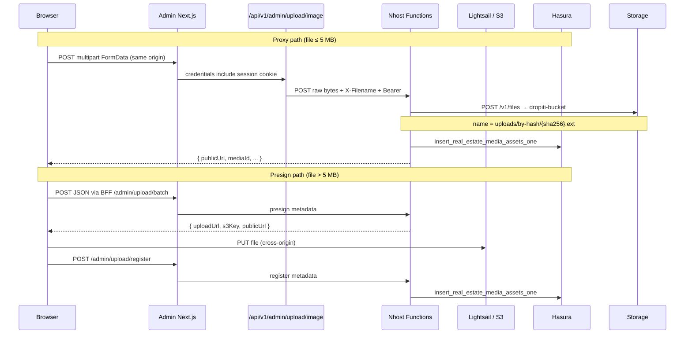

# Hybrid admin media upload

> **Canonical spec:** [media-upload.md](./media-upload.md) (dedup/repair/migrate, API contract, env).  
> This document retains S3 presign/CORS/architecture detail for the **S3 fallback** path.

This document describes how the **Dropiti Admin Console** uploads media using **Nhost Storage** (`dropiti-bucket`) by default, with optional **S3/Lightsail fallback**.

## Storage backend

| Backend | Bucket | Object path (Hasura `s3_key`) | When used |
|---------|--------|-----------------------------|-----------|
| **Nhost Storage** (default) | `dropiti-bucket` | `uploads/by-hash/{sha256}.{ext}` | Nhost subdomain + region available in Functions |
| **S3 / Lightsail** (fallback) | `S3_BUCKET_NAME` | Same hash path for presign/proxy | `MEDIA_STORAGE_BACKEND=s3` or Storage URL unavailable |

Monolith-compatible paths: **`uploads/by-hash/{sha256}.{ext}`** for all single, proxy, and batch uploads.

---

## Upload paths (Nhost Storage — default)

| Path | File size | Browser talks to | Bucket CORS? |
|------|-----------|------------------|--------------|
| **Proxy** | ≤ 10 MB | Same-origin admin app only | **No** |
| **Batch** | Same | Proxy per file (`useProxy: true`) | **No** |

With Nhost Storage, all media-library uploads (≤ 10 MB) use the **proxy** route — no browser PUT to external storage.

---

## Upload paths (S3 fallback)

| Path | File size | Browser talks to | S3 bucket CORS? |
|------|-----------|------------------|-----------------|
| **Proxy** | ≤ 5 MB | Same-origin admin app only | **No** |
| **Presign** | > 5 MB (up to 10 MB UI cap) | S3/Lightsail directly (`PUT`) | **Yes** |

Both paths persist a row in `real_estate_media_assets` so uploads appear in **Media Library**.

---

## Why hybrid?

The decoupled architecture moved S3 credentials off the admin console and into **Nhost Functions**. The original presign-only design let the browser upload directly to S3, which is efficient but requires:

1. **CSP** `connect-src` allowlisting S3 hosts (`next.config.ts`)
2. **Bucket CORS** on Lightsail/S3 (`dropiti-nhost/infrastructure/lightsail-bucket-cors.json`)

Most admin images are small (especially after client-side resize). Proxying those through same-origin routes avoids cross-origin S3 calls entirely. Larger files still use presigned PUT to stay within Nhost Function memory and timeout limits.

---

## Architecture overview



---

## Size policy

Constants are defined in two places (keep them in sync):

| Constant | Nhost | S3 fallback | Location |
|----------|-------|-------------|----------|
| Proxy max | 10 MB | 5 MB | `upload-policy.ts` (both repos) |
| UI `maxSize` | 10 MB | 10 MB | `media-library/page.tsx` |
| Hash path | `uploads/by-hash/{sha256}.{ext}` | same | `_lib/storage-paths.ts` |

**Admin console:** set `NEXT_PUBLIC_MEDIA_STORAGE_BACKEND=nhost` so the client uses the 10 MB proxy cap.

**Routing rule** (`adminUploadImages`):

- Nhost: all files ≤ 10 MB → proxy
- S3: ≤ 5 MB → proxy; > 5 MB → presign + PUT + register

---

## Proxy path (≤ 5 MB)

### 1. Browser → Admin Next.js

`adminUploadImages()` calls the dedicated same-origin route (not the generic JSON BFF):

```
POST /api/v1/admin/upload/image
Content-Type: multipart/form-data
Cookie: nhost_access_token=…

file: <binary>
```

Implementation: `src/app/api/v1/admin/upload/image/route.ts`

### 2. Next.js → Nhost Function

The route reads the session cookie, extracts the file from `FormData`, and forwards **raw bytes**:

```
POST {NEXT_PUBLIC_FUNCTIONS_URL}/v1/admin/upload/image
Authorization: Bearer <access token>
Content-Type: <file mime>
X-Filename: <url-encoded original name>
X-Width / X-Height / X-Sha256: optional
Body: raw file bytes
```

Implementation: `dropiti-nhost/functions/admin/upload/image.ts`

### 3. Nhost → S3 + Hasura

- Validates admin JWT, MIME allowlist, size ≤ 5 MB, rate limit
- `putObjectToS3()` in `_lib/s3.ts` — content-hash key `uploads/by-hash/{sha256}.{ext}` with optional dedup via `HeadObject` (skipped when IAM lacks `s3:GetObject`)
- `insertMediaAsset()` in `_lib/media-assets.ts` — Hasura mutation

### Response envelope

```json
{
  "ok": true,
  "data": {
    "filename": "photo.webp",
    "publicUrl": "https://…/uploads/by-hash/abc….webp",
    "s3Key": "uploads/by-hash/abc….webp",
    "fileId": "uploads/by-hash/abc….webp",
    "sha256": "abc…",
    "deduped": false,
    "mediaId": "uuid",
    "imageHints": { "maxWidth": 1600, "maxHeight": 1600, "webpQuality": 75 }
  }
}
```

---

## Presign path (> 5 MB)

For files above the proxy threshold, the flow matches the original decouple design with one addition: **register** after successful S3 PUT.

### Step 1 — Batch presign

```
POST /api/v1/bff/functions/admin/upload/batch
{ "filename": "…", "mimeType": "…" }
```

→ Nhost `functions/admin/upload/batch.ts` → S3 presigned URL (`admin-uploads/{date}/{uuid}-{name}` key pattern)

### Step 2 — Browser PUT to S3

```javascript
fetch(uploadUrl, { method: 'PUT', body: file, headers: { 'Content-Type': file.type } })
```

Requires **bucket CORS** and **CSP connect-src** for S3 hosts.

### Step 3 — Register in Hasura

```
POST /api/v1/bff/functions/admin/upload/register
{
  "s3Key": "…",
  "publicUrl": "https://…",
  "filename": "…",
  "mimeType": "…",
  "sizeBytes": 8388608,
  "sha256": "…"
}
```

Implementation: `dropiti-nhost/functions/admin/upload/register.ts`

The client computes `sha256` in the browser before register (`crypto.subtle.digest`).

---

## API reference

| Method | Path | Purpose |
|--------|------|---------|
| `POST` | `/api/v1/admin/upload/image` | Admin proxy (Next.js only) |
| `POST` | `/v1/admin/upload/image` | Nhost raw-body proxy handler |
| `POST` | `/v1/admin/upload/batch` | Presign up to 20 files |
| `POST` | `/v1/admin/upload/presign` | Single-file presign |
| `POST` | `/v1/admin/upload/register` | Hasura row after presign PUT |
| `GET` | `/v1/admin/media` | List media library |

BFF mapping for JSON routes: `src/lib/bff-route-rewrite.ts`  
Client entry point: `src/lib/admin-api.ts` → `adminUploadImages()`

---

## Security

| Concern | Mitigation |
|---------|------------|
| S3 credentials in browser | Never — only Nhost Functions hold `S3_BUCKET_*` |
| Unauthenticated upload | Proxy route requires `nhost_access_token` cookie; Nhost requires admin JWT |
| MIME allowlist | `_lib/upload-policy.ts`: jpeg, png, webp, pdf, mp4 |
| Rate limits | Upstash: `upload:image`, `upload:batch`, `upload:register` per admin |
| Proxy size cap | 5 MB enforced in Next (implicit) and Nhost (413) |

---

## S3 / Lightsail IAM permissions

The access key in Nhost secrets (`S3_BUCKET_ACCESS_KEY` / `S3_BUCKET_SECRET_KEY`) must be able to write to the bucket from **Nhost Functions** (server-side SDK calls).

### Minimum (proxy uploads work)

| Permission | Why |
|------------|-----|
| `s3:PutObject` on `arn:aws:s3:::YOUR_BUCKET/*` | Required for proxy and presign uploads |

For **Lightsail Object Storage**, create access keys in **Lightsail → Storage → your bucket → Access keys** (not a generic IAM user unless it has bucket access).

### Optional (content-hash dedup)

| Permission | Why |
|------------|-----|
| `s3:GetObject` on `arn:aws:s3:::YOUR_BUCKET/*` | Lets `HeadObject` detect existing hash keys and skip re-upload |

If the key only has **`PutObject`**, AWS returns **403** (not 404) on `HeadObject` for missing objects. The code treats that as “not present” and proceeds to `PutObject` — uploads work, dedup is skipped.

### Verify with AWS CLI

```bash
export AWS_ACCESS_KEY_ID="..."   # same as Nhost secret
export AWS_SECRET_ACCESS_KEY="..."
export AWS_DEFAULT_REGION="ap-northeast-2"

aws s3 cp /tmp/test.txt "s3://YOUR_BUCKET/uploads/by-hash/diagnostic-test.txt"
```

If this fails with 403, fix credentials or permissions before retrying in the admin UI.

---

## Operations checklist

### Proxy uploads (typical images)

- [ ] Nhost secret: `MEDIA_STORAGE_BUCKET=dropiti-bucket` (wired in `nhost.toml` `[[global.environment]]`; name must not start with `NHOST_`)
- [ ] Nhost secrets (S3 fallback only): `S3_BUCKET_ACCESS_KEY`, `S3_BUCKET_SECRET_KEY`, `S3_BUCKET_NAME`, `S3_BUCKET_AWS_REGION`, optional `S3_BUCKET_DOMAIN_URL`
- [ ] `nhost/nhost.toml` maps S3 env to Functions
- [ ] Admin `.env`: `NEXT_PUBLIC_FUNCTIONS_URL`
- [ ] Admin user signed in (httpOnly cookie on same origin)
- **Bucket CORS not required** for proxy-only traffic

### Presign uploads (> 5 MB)

- [ ] All of the above, plus:
- [ ] Bucket CORS applied — see `dropiti-nhost/infrastructure/README.md`
- [ ] Production admin origin added to `AllowedOrigins` in `lightsail-bucket-cors.json`
- [ ] CSP `connect-src` includes S3 hosts — `next.config.ts` `s3ConnectSrcAllowlist()`

### Apply bucket CORS (Lightsail)

```bash
aws lightsail update-bucket \
  --bucket-name tastyplates-bucket \
  --cors file://infrastructure/lightsail-bucket-cors.json
```

Run from `dropiti-nhost` repo root.

---

## Nhost platform limits

Relevant when using the **proxy** path (file bytes pass through Functions):

| Limit | Value | Notes |
|-------|-------|-------|
| Response payload | 6 MB hard cap | Proxy responses are JSON — fine |
| Request body | Undocumented; 5 MB cap chosen conservatively | Avoid buffering 10 MB in Functions |
| Execution timeout | 10s (Starter) / 180s (Pro) | Large proxy uploads need Pro for headroom |
| Native deps | Not allowed | Client-side resize only; no `sharp` in Functions |

---

## Key source files

### Admin console (`dropiti-admin-console-2`)

| File | Role |
|------|------|
| `src/lib/admin-api.ts` | `adminUploadImages()` — hybrid router |
| `src/lib/upload-policy.ts` | Size thresholds |
| `src/lib/admin-routes.ts` | `uploadBatch`, `uploadRegister` |
| `src/app/api/v1/admin/upload/image/route.ts` | Multipart → raw bytes proxy |
| `src/app/(admin)/dashboard/media-library/page.tsx` | Dropzone UI |
| `next.config.ts` | CSP S3 allowlist (presign path) |

### Nhost Functions (`dropiti-nhost`)

| File | Role |
|------|------|
| `functions/admin/upload/image.ts` | Proxy upload handler |
| `functions/admin/upload/register.ts` | Post-presign Hasura insert |
| `functions/admin/upload/batch.ts` | Batch presign |
| `functions/admin/upload/presign.ts` | Single presign |
| `functions/_lib/s3.ts` | Presign + `putObjectToS3` |
| `functions/_lib/media-assets.ts` | Hasura insert mutation |
| `functions/_lib/upload-policy.ts` | MIME + size constants |
| `infrastructure/lightsail-bucket-cors.json` | Bucket CORS template |

### Legacy reference (monolith)

| File | Role |
|------|------|
| `dropiti-backend/src/routes/v1/upload.ts` | Original same-origin proxy + Hasura insert |

---

## Troubleshooting

| Symptom | Likely cause | Fix |
|---------|--------------|-----|
| `Session required` on upload | No `nhost_access_token` cookie | Sign in; use same host as login (localhost vs 127.0.0.1) |
| `S3 upload is not configured` | Missing Nhost S3 secrets | Dashboard secrets + `nhost.toml` |
| Nhost log `HeadObject 403` then upload works | Upload-only IAM key (no `GetObject`) | Expected — dedup skipped; add `GetObject` only if you want hash dedup |
| `S3 PutObject failed (403 …)` in UI or logs | Wrong secrets, region, bucket name, or missing `PutObject` | Sync Nhost secrets; verify CLI `aws s3 cp` with same key |
| `[admin/upload/image] UnknownError` + HTTP 403 in `$metadata` | Same as above — was often HeadObject before fix; now usually PutObject | See **S3 / Lightsail IAM permissions** above |
| CORS error on PUT to S3 | File > 5 MB using presign path | Apply bucket CORS; or resize file under 5 MB for proxy |
| CSP blocks PUT to S3 | Presign path, missing connect-src | Check `next.config.ts` S3 allowlist |
| Upload succeeds but not in library | Register/insert failed | Check Nhost logs for Hasura errors on `insert_real_estate_media_assets_one` |
| `File too large for proxy upload` | File > 5 MB hit proxy endpoint directly | Expected — use presign path (automatic in `adminUploadImages`) |
| 413 from Nhost | Body > 5 MB on `/upload/image` | Resize or use presign |

---

## Testing

### Proxy (≤ 5 MB)

1. Sign in to admin at `http://localhost:3000`
2. Open **Media Library**, upload a PNG/JPG/WebP under 5 MB
3. Confirm toast success and new row in the grid
4. Network tab: `POST /api/v1/admin/upload/image` → 200, **no** request to `*.amazonaws.com`

### Presign (> 5 MB)

1. Upload a file between 5 MB and 10 MB (or temporarily lower proxy threshold in dev)
2. Network tab: `POST …/admin/upload/batch` → `PUT` to S3 → `POST …/admin/upload/register`
3. Confirm media row appears

### Dedup (proxy)

1. Upload the same file twice via proxy
2. Second response should include `"deduped": true`; S3 should not duplicate object (hash key)

---

## Future improvements

- **Client-side WebP resize** before upload so more files stay under 5 MB and use proxy
- **Single register batch** endpoint after multi-file presign PUT
- **Unify S3 key strategy** (hash-based keys for presign as well as proxy)
- **Progress UI** for large presign uploads
- **Nhost Run** if full 10 MB proxy through server is ever required without bucket CORS

---

## Related docs

- `documentation/guides/decouple-plan-v4.md` — Phase 5 upload migration (presign baseline; hybrid extends it)
- `documentation/guides/media-library.md` — Media library product notes
- `dropiti-nhost/infrastructure/README.md` — Bucket CORS setup
- `dropiti-nhost/documentation/api-doc-v1.md` — Functions API envelope and auth
