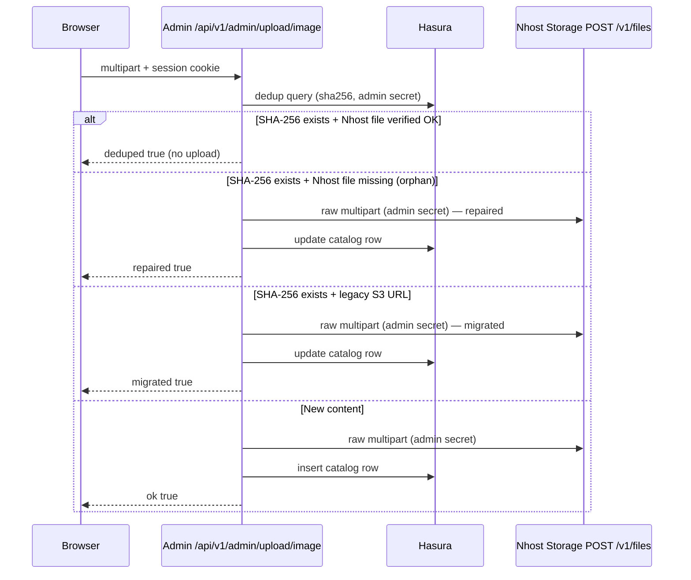

# Media upload — v2 (canonical)

Single reference for admin media uploads across **dropiti-admin-console-2** and **dropiti-nhost** Functions.

> **v2 change (Jun 2026):** The Next.js upload proxy now uploads file bytes **directly** to Nhost Storage, bypassing the Nhost Function for the binary transfer leg. This eliminates the `readRawBody` serialisation hop that caused byte corruption and `storage.files.mime_type = application/octet-stream`. The Nhost Function (`POST /v1/admin/upload/image`) is no longer in the upload hot-path for the admin console but remains available for other clients (mobile apps, etc.).

> Legacy detail on hybrid S3 presign: see [hybrid-upload.md](./hybrid-upload.md) (points here for policy).

---

## Data model (`real_estate_media_assets`)

| Column | Meaning |
|--------|---------|
| `public_url` | **Canonical** URL stored in Hasura and copied to property galleries |
| `s3_key` | Logical object path (`uploads/by-hash/{sha256}.{ext}`) — not a browser URL for Nhost rows |
| `s3_bucket` | Nhost bucket id (`dropiti-bucket` / `default`) or S3 bucket name |
| `sha256` | Content hash for dedup |
| `content_type` | MIME type as detected by hasura-storage from file content (authoritative ≥ v0.12.0) |

**Invariant (Nhost backend):** every active row with a Nhost `public_url` (`…/v1/files/{uuid}`) must have that UUID present in Nhost Storage (`storage.files`).

---

## Storage backends

| Backend | Bucket | When used |
|---------|--------|-----------|
| **Nhost Storage** (default) | `NHOST_STORAGE_BUCKET` → `dropiti-bucket` or `default` | `NEXT_PUBLIC_MEDIA_STORAGE_BACKEND=nhost` |
| **S3 / Lightsail** (legacy) | `S3_BUCKET_NAME` | `NEXT_PUBLIC_MEDIA_STORAGE_BACKEND=s3` or legacy rows |

---

## Upload flow — v2 (Nhost, default)



### Step-by-step

1. **Browser →** `POST /api/v1/admin/upload/image` (multipart + `nhost_access_token` cookie).
2. **Session guard** — route checks `nhost_access_token` cookie is present.
3. **SHA-256 dedup** — `real_estate_media_assets` is queried by `sha256` (Hasura admin secret).
   - Hit + Nhost file verified → return `deduped: true` immediately.
   - Hit + file missing or legacy S3 URL → proceed to upload (`repaired` / `migrated`).
4. **Direct storage upload** — raw multipart POSTed from the Next.js server to `{storageBase}/files` using `x-hasura-admin-secret`. File bytes come from `fileEntry.arrayBuffer()` — no intermediate serialisation hop.
5. **MIME detection** — hasura-storage ≥ v0.12.0 runs `mimetype.DetectReader` on the file content bytes and stores the detected `mime_type` in `storage.files`. `content_type` saved to `real_estate_media_assets` equals this detected value.
6. **Catalog persistence** — Hasura `insert_real_estate_media_assets_one` (or `update_…_by_pk` for repair/migrate). Failure → **502** (no success without catalog).

### Why raw multipart instead of Web FormData?

The manual boundary construction (`Buffer.concat([preamble, fileBytes, epilogue])`) mirrors `postMultipartToNhostStorage` in the Nhost Function. It guarantees:
- Exact `Content-Type` on the wire for the file part.
- No undici `Blob.type` forwarding uncertainty across Node.js versions.
- Explicit `Content-Length` so hasura-storage parses the boundary correctly.

Since file bytes enter at `fileEntry.arrayBuffer()` — the App Router's native multipart parser — there is no `readRawBody` / Express middleware step that could corrupt them.

---

## Why the old flow was broken (root cause)

**hasura-storage ≥ v0.12.0** (released 2026-03-18, CVE-2026-33221) ignores client-provided `Content-Type` headers and detects `mime_type` solely from file content using `mimetype.DetectReader`.

The old pipeline was:

```
Browser (multipart) → Next.js proxy → Nhost Function readRawBody()
  → rebuild multipart → Nhost Storage (detects MIME from bytes)
```

`readRawBody` in Express could return corrupted bytes (base64-decoded, truncated, or double-buffered depending on middleware state). Corrupted bytes → `DetectReader` returns `application/octet-stream` → stored in both `storage.files.mime_type` and `real_estate_media_assets.content_type`.

The v2 flow removes the Nhost Function from the binary path entirely.

---

## Upload flow — S3 fallback (legacy)

- ≤ proxy cap: same proxy handler → `putObjectToS3`.
- \> proxy cap: presign batch → browser PUT → `register` (validates URL when Nhost-shaped).

See [hybrid-upload.md](./hybrid-upload.md).

---

## API response

`POST /api/v1/admin/upload/image` (Next.js proxy — same shape as old Nhost Function):

```json
{
  "ok": true,
  "data": {
    "filename": "photo.webp",
    "publicUrl": "https://{sub}.storage.{region}.nhost.run/v1/files/{uuid}",
    "s3Key": "uploads/by-hash/{sha256}.webp",
    "fileId": "{uuid}",
    "storageFileId": "{uuid}",
    "sha256": "...",
    "mediaId": "...",
    "deduped": false,
    "repaired": false,
    "migrated": false,
    "storageBackend": "nhost"
  }
}
```

| Flag | Meaning |
|------|---------|
| `deduped` | Same SHA-256; Nhost Storage file verified present; catalog row reused |
| `repaired` | Row had a Nhost URL but Storage file was missing; re-uploaded + catalog updated |
| `migrated` | Row had a legacy S3 `public_url`; uploaded to Nhost + catalog updated |

Admin client parsing: `formatUploadResultMessage()` in `src/lib/admin-api.ts`.

---

## Display vs canonical URL

| Use case | Helper |
|----------|--------|
| `<Image src>` in admin | `getMediaDisplayUrl()` → `/api/v1/admin/media/file/{uuid}` for Nhost |
| Save to property / Hasura | `getMediaCanonicalUrl()` → stored `public_url` |

Implementation: `src/lib/media-url.ts`, proxy route `src/app/api/v1/admin/media/file/[fileId]/route.ts`.

The display proxy (`/api/v1/admin/media/file/[fileId]`) fetches from Nhost Storage with the admin secret, so image display works regardless of bucket visibility settings.

---

## Environment

### Admin (`dropiti-admin-console-2`)

| Variable | Required | Purpose |
|----------|----------|---------|
| `NEXT_PUBLIC_NHOST_SUBDOMAIN` | ✅ | Nhost project subdomain (storage + Hasura host) |
| `NEXT_PUBLIC_NHOST_REGION` | ✅ | Nhost region (e.g. `ap-southeast-1`) |
| `HASURA_GRAPHQL_ADMIN_SECRET` | ✅ | Hasura + Nhost Storage admin access (server-only) |
| `NEXT_PUBLIC_MEDIA_STORAGE_BACKEND` | ✅ | Set to `nhost` |
| `NHOST_STORAGE_BUCKET` | ⚠️ | Target bucket id — defaults to `default`. Set to match the Nhost Functions `MEDIA_STORAGE_BUCKET` secret (e.g. `dropiti-bucket`) |
| `HASURA_ENDPOINT` | optional | Override Hasura GraphQL URL (auto-derived from subdomain+region) |
| `NEXT_PUBLIC_FUNCTIONS_URL` | optional | Needed only for other BFF calls (batch presign, get-file fallback) |

### Functions (`dropiti-nhost`) — still used for non-upload BFF calls

| Variable | Purpose |
|----------|---------|
| `MEDIA_STORAGE_BUCKET` | `dropiti-bucket` (must match `NHOST_STORAGE_BUCKET` in admin) |
| `HASURA_GRAPHQL_ADMIN_SECRET` | Storage POST/GET + Hasura |
| `NHOST_SUBDOMAIN` / `NHOST_REGION` | Storage base URL |

---

## Troubleshooting

| Symptom | Likely cause | Action |
|---------|--------------|--------|
| `storage.files.mime_type = application/octet-stream` | Old upload (pre-v2) or corrupted bytes | Re-upload same file via admin console (v2 path) |
| Row in media library, no file in Storage | Orphan UUID (old dedup without verify) | Re-upload → `repaired: true` |
| `deduped: true` but image 404 | Orphan UUID | Re-upload to repair |
| S3 URL in DB, Nhost backend | Not migrated yet | Re-upload → `migrated: true` |
| Upload 502 "Storage upload failed" | Nhost Storage unreachable or bad admin secret | Check `HASURA_GRAPHQL_ADMIN_SECRET` and subdomain/region |
| Upload 502 "Failed to save media catalog" | Hasura insert/update failed | Check Hasura permissions / admin secret |
| Upload 503 "not configured" | Missing env vars | Add `NEXT_PUBLIC_NHOST_SUBDOMAIN`, `NEXT_PUBLIC_NHOST_REGION`, `HASURA_GRAPHQL_ADMIN_SECRET` |
| Images not displaying | Display proxy misconfigured | Verify `HASURA_GRAPHQL_ADMIN_SECRET` is quoted in `.env.local` if it contains `%` or `;` |
| Wrong bucket | `NHOST_STORAGE_BUCKET` mismatch | Set `NHOST_STORAGE_BUCKET=dropiti-bucket` (or your bucket name) |

---

## Key source files

| Repo | File | Role |
|------|------|------|
| admin | `src/app/api/v1/admin/upload/image/route.ts` | **v2 upload handler** — parses browser multipart, dedup, direct storage POST, catalog persist |
| admin | `src/lib/admin-api.ts` | Client upload trigger + response message formatting |
| admin | `src/lib/media-url.ts` | Display vs canonical URL helpers |
| admin | `src/app/api/v1/admin/media/file/[fileId]/route.ts` | Display proxy — streams from Nhost Storage with admin secret |
| admin | `src/lib/nhost-storage-server.ts` | Server-only helpers: admin secret reader, storage URL builder, display proxy utilities |
| nhost | `functions/admin/upload/image.ts` | Legacy Nhost Function upload handler (still active for non-admin-console clients) |
| nhost | `functions/_lib/media-storage.ts` | Orchestration (used by Nhost Function path) |
| nhost | `functions/_lib/nhost-storage.ts` | Storage POST + existence check (used by Nhost Function path) |
| nhost | `functions/_lib/media-assets.ts` | Hasura insert/update (used by Nhost Function path) |

---

## Consumers (out of scope here)

**dropiti-v3** loading `public_url` directly requires Storage **public** Download permission and `next.config` remote patterns for `*.storage.*.nhost.run`. See `dropiti-nhost/secrets/README.md`.

**Mobile apps** can still use `POST {FUNCTIONS_URL}/v1/admin/upload/image` with a Bearer JWT — the Nhost Function remains deployed and handles the full upload+catalog pipeline for non-browser clients.
