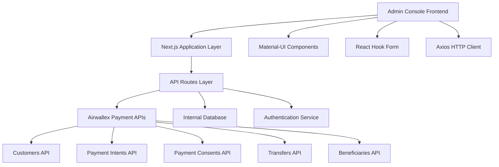
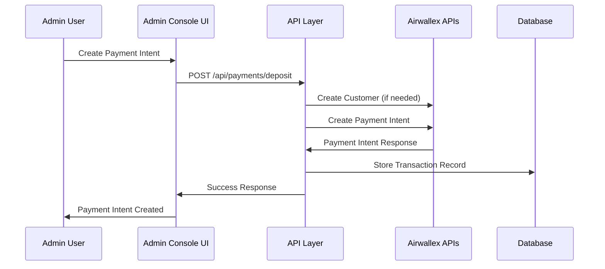
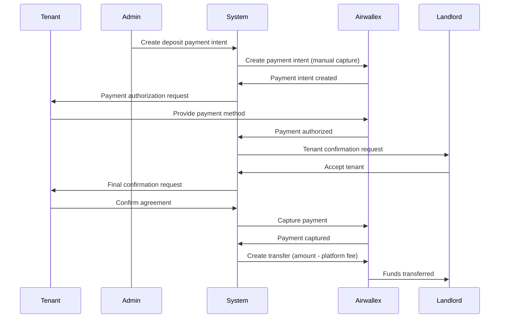
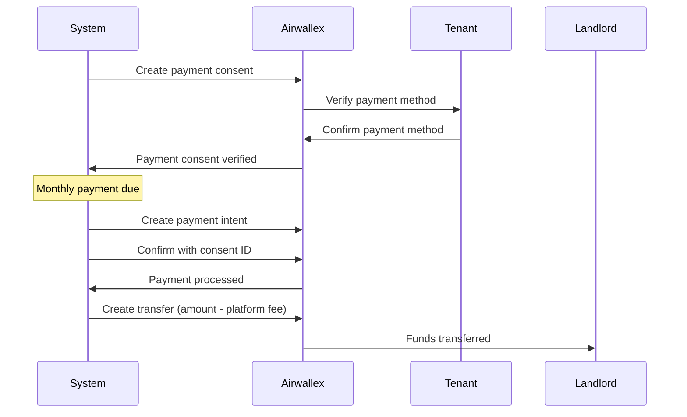
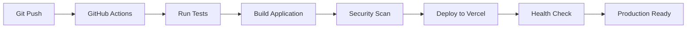

# Dropiti Admin Console - Technical Specification (v1)

## Table of Contents
- [1. Project Overview](#1-project-overview)
- [2. System Architecture](#2-system-architecture)
- [3. Technology Stack](#3-technology-stack)
- [4. API Integration](#4-api-integration)
- [5. Data Models](#5-data-models)
- [6. User Interface Components](#6-user-interface-components)
- [7. Payment Processing Flows](#7-payment-processing-flows)
- [8. Security Implementation](#8-security-implementation)
- [9. Error Handling Strategy](#9-error-handling-strategy)
- [10. Performance Considerations](#10-performance-considerations)
- [11. Deployment Architecture](#11-deployment-architecture)
- [12. Testing Strategy](#12-testing-strategy)
- [13. Monitoring & Logging](#13-monitoring--logging)
- [14. Future Considerations](#14-future-considerations)

## 1. Project Overview

### 1.1 Project Description
Dropiti Admin Console is a comprehensive administrative interface for managing a real estate rental platform. The system facilitates payment processing between tenants and landlords through Airwallex integration, handling pre-tenancy deposits, recurring rental payments, and fund distribution with automated platform fee calculation.

### 1.2 Core Objectives
- **Payment Management**: Streamline deposit and rental payment processing
- **Fund Distribution**: Automate transfers to landlords with platform fee deduction
- **Customer Management**: Centralized tenant and landlord information management
- **Beneficiary Management**: Secure handling of payment recipient information
- **Compliance**: Ensure PCI compliance and financial regulation adherence
- **Transparency**: Provide comprehensive transaction tracking and reporting

### 1.3 Key Features
- Multi-flow payment processing (deposits, recurring payments, transfers)
- Real-time payment status tracking
- Automated platform fee calculation (5% deposits, 3% rent)
- Comprehensive customer and beneficiary management
- Integration with Airwallex payment infrastructure
- Responsive web interface with Material-UI components

## 2. System Architecture

### 2.1 High-Level Architecture



### 2.2 Component Architecture

```
src/
├── app/
│   ├── dashboard/
│   │   ├── customers/
│   │   ├── beneficiaries/
│   │   ├── payments/
│   │   └── transfers/
│   └── api/
│       ├── customer/
│       ├── beneficiaries/
│       ├── payments/
│       └── transfers/
├── components/
│   ├── dashboard/
│   │   ├── payment/
│   │   ├── customer/
│   │   ├── beneficiary/
│   │   └── transfer/
│   └── ui/
├── hooks/
├── lib/
└── types/
```

### 2.3 Data Flow Architecture



## 3. Technology Stack

### 3.1 Frontend Technologies
| Technology | Version | Purpose |
|------------|---------|---------|
| **Next.js** | 14.x | React framework with SSR/SSG capabilities |
| **React** | 18.x | Component-based UI library |
| **TypeScript** | 5.x | Type-safe JavaScript development |
| **Material-UI (MUI)** | 5.x | Component library and design system |
| **Axios** | 1.x | HTTP client for API communication |
| **React Hook Form** | 7.x | Form state management and validation |

### 3.2 Backend Technologies
| Technology | Purpose |
|------------|---------|
| **Next.js API Routes** | Server-side API endpoints |
| **Airwallex SDK** | Payment processing integration |
| **JSON Web Tokens (JWT)** | Authentication and session management |

### 3.3 Development Tools
| Tool | Purpose |
|------|---------|
| **ESLint** | Code linting and style enforcement |
| **Prettier** | Code formatting |
| **TypeScript Compiler** | Type checking and compilation |
| **Vercel** | Deployment and hosting platform |

## 4. API Integration

### 4.1 Airwallex API Integration

#### 4.1.1 Authentication
```typescript
interface AirwallexConfig {
  apiKey: string;
  clientId: string;
  environment: 'demo' | 'prod';
  baseUrl: string;
}
```

#### 4.1.2 Core API Endpoints

##### Customer Management
```typescript
// GET /api/customer
interface CustomerResponse {
  items: Customer[];
  has_more: boolean;
  next_cursor?: string;
}

interface Customer {
  id: string;
  first_name?: string;
  last_name?: string;
  name?: string;
  email?: string;
  phone?: string;
  created_at: string;
  updated_at: string;
}
```

##### Payment Processing
```typescript
// POST /api/payments/deposit
interface DepositPaymentRequest {
  customer_id: string;
  payment_intent: {
    amount: number;
    currency: string;
    capture_method: 'manual';
    descriptor: string;
    metadata: PaymentMetadata;
  };
}

// POST /api/payments/recurring
interface RecurringPaymentRequest {
  customer_id: string;
  currency: string;
  metadata: RecurringMetadata;
}
```

##### Transfer Management
```typescript
// POST /api/transfers
interface TransferRequest {
  source_payment_id: string;
  beneficiary_id: string;
  transfer_amount: number;
  transfer_currency: string;
  reference: string;
  platform_fee: number;
  metadata: TransferMetadata;
}
```

##### Beneficiary Management
```typescript
// GET /api/beneficiaries
interface BeneficiaryResponse {
  items: Beneficiary[];
  has_more: boolean;
}

interface Beneficiary {
  id: string;
  nickname?: string;
  account_name?: string;
  entity_type?: 'PERSONAL' | 'COMPANY';
  beneficiary?: {
    entity_type?: string;
    account_name?: string;
    bank_details?: BankDetails;
  };
}
```

### 4.2 Internal API Endpoints

#### 4.2.1 Payment Endpoints
- `POST /api/payments/deposit` - Create deposit payment intent
- `POST /api/payments/recurring` - Create recurring payment consent
- `POST /api/payments/capture` - Capture authorized payment
- `GET /api/payments` - List payment transactions

#### 4.2.2 Customer Management
- `GET /api/customer` - List customers
- `POST /api/customer` - Create new customer
- `PUT /api/customer/{id}` - Update customer information

#### 4.2.3 Transfer Management
- `POST /api/transfers` - Create fund transfer
- `GET /api/transfers` - List transfers
- `GET /api/transfers/{id}` - Get transfer details

## 5. Data Models

### 5.1 Core Entities

#### 5.1.1 Customer Entity
```typescript
interface Customer {
  id: string;
  first_name?: string;
  last_name?: string;
  name?: string;
  email: string;
  phone?: string;
  created_at: string;
  updated_at: string;
  airwallex_customer_id: string;
}
```

#### 5.1.2 Payment Entity
```typescript
interface Payment {
  id: string;
  customer_id: string;
  landlord_id: string;
  property_id: string;
  amount: number;
  currency: string;
  payment_type: 'deposit' | 'rent' | 'other';
  platform_fee: number;
  status: PaymentStatus;
  payment_intent_id: string;
  metadata: PaymentMetadata;
  created_at: string;
  updated_at: string;
}

type PaymentStatus = 
  | 'requires_payment_method'
  | 'requires_confirmation'
  | 'requires_action'
  | 'processing'
  | 'succeeded'
  | 'failed'
  | 'cancelled';
```

#### 5.1.3 Transfer Entity
```typescript
interface Transfer {
  id: string;
  source_payment_id: string;
  beneficiary_id: string;
  amount: number;
  currency: string;
  platform_fee: number;
  status: TransferStatus;
  airwallex_transfer_id: string;
  reference: string;
  created_at: string;
  updated_at: string;
}

type TransferStatus = 
  | 'created'
  | 'sent'
  | 'received'
  | 'failed'
  | 'cancelled';
```

### 5.2 Form Data Models

#### 5.2.1 Deposit Payment Form
```typescript
interface DepositPaymentFormData {
  customer_id: string;
  customer_email: string;
  customer_name: string;
  property_id: string;
  property_address: string;
  landlord_id: string;
  deposit_amount: string;
  currency: string;
  description: string;
  agreement_id: string;
  rent_amount: string;
}
```

#### 5.2.2 Recurring Payment Form
```typescript
interface RecurringPaymentFormData {
  customer_id: string;
  customer_email: string;
  customer_name: string;
  property_id: string;
  property_address: string;
  landlord_id: string;
  rent_amount: string;
  currency: string;
  payment_day: string;
  agreement_id: string;
}
```

#### 5.2.3 Transfer Form
```typescript
interface TransferFormData {
  source_payment_id: string;
  source_amount: string;
  source_currency: string;
  beneficiary_id: string;
  transfer_amount: string;
  platform_fee: string;
  transfer_currency: string;
  reference: string;
  payment_type: string;
}
```

## 6. User Interface Components

### 6.1 Component Hierarchy

```
DashboardLayout
├── Navigation
│   ├── SidebarNav
│   └── TopBar
├── MainContent
│   ├── PaymentManagement
│   │   ├── CreateDepositPaymentForm
│   │   ├── CreateRecurringPaymentForm
│   │   └── PaymentsList
│   ├── TransferManagement
│   │   ├── CreateTransferForm
│   │   └── TransfersList
│   ├── CustomerManagement
│   │   ├── CustomersList
│   │   └── CustomerDetails
│   └── BeneficiaryManagement
│       ├── BeneficiariesList
│       └── BeneficiaryDetails
```

### 6.2 Key Component Specifications

#### 6.2.1 CreateDepositPaymentForm
- **Purpose**: Create manual-capture payment intents for deposits
- **Key Features**:
  - Customer selection from Airwallex system
  - Property information input
  - Deposit amount and currency selection
  - Real-time validation
  - Loading states and error handling

#### 6.2.2 CreateRecurringPaymentForm
- **Purpose**: Set up payment consents for monthly rent
- **Key Features**:
  - Customer selection with rich display
  - Payment day configuration
  - Recurring amount setup
  - Agreement linking

#### 6.2.3 CreateTransferForm
- **Purpose**: Transfer funds to landlords with fee calculation
- **Key Features**:
  - Source payment selection
  - Beneficiary selection with detailed info
  - Automatic platform fee calculation
  - Transfer amount confirmation

### 6.3 UI/UX Design Patterns

#### 6.3.1 Form Design
- **Multi-step cards**: Logical grouping of related fields
- **Autocomplete dropdowns**: Searchable selection with rich options
- **Loading states**: Clear feedback during API operations
- **Error handling**: Inline validation and error messages
- **Success feedback**: Toast notifications for completed actions

#### 6.3.2 Data Display
- **Responsive tables**: Sortable and filterable data grids
- **Status indicators**: Color-coded chips for status display
- **Information cards**: Summary displays with key metrics
- **Detail panels**: Expandable sections for additional information

## 7. Payment Processing Flows

### 7.1 Pre-tenancy Deposit Flow



### 7.2 Monthly Rental Payment Flow



### 7.3 Platform Fee Calculation

```typescript
function calculatePlatformFee(amount: number, paymentType: string): number {
  const feeRates = {
    deposit: 0.05,        // 5% for deposits
    monthly_rent: 0.03,   // 3% for monthly rent
    other: 0.04           // 4% for other payments
  };
  
  const rate = feeRates[paymentType] || feeRates.other;
  return amount * rate;
}

function calculateTransferAmount(sourceAmount: number, paymentType: string): number {
  const platformFee = calculatePlatformFee(sourceAmount, paymentType);
  return sourceAmount - platformFee;
}
```

## 8. Security Implementation

### 8.1 API Security

#### 8.1.1 Authentication
- **JWT-based authentication** for admin users
- **API key management** for Airwallex integration
- **Role-based access control** for different admin levels

#### 8.1.2 Data Protection
- **HTTPS enforcement** for all communications
- **Input validation** on all form submissions
- **SQL injection prevention** through parameterized queries
- **XSS protection** through content security policies

### 8.2 PCI Compliance

#### 8.2.1 Payment Data Handling
- **No card storage**: All payment methods stored securely in Airwallex
- **Tokenization**: Use payment consents for recurring payments
- **Secure transmission**: All payment data transmitted over HTTPS
- **Audit logging**: Comprehensive logs for all payment operations

#### 8.2.2 Access Controls
- **Principle of least privilege**: Users have minimum required permissions
- **Session management**: Secure session handling with timeout
- **Activity monitoring**: Track all administrative actions

### 8.3 Environment Security

```typescript
// Environment configuration
interface SecurityConfig {
  airwallex: {
    apiKey: string;        // Stored in secure environment variables
    clientId: string;      // Separate client ID for each environment
    environment: 'demo' | 'prod';
  };
  jwt: {
    secret: string;        // Secure random secret for JWT signing
    expiresIn: string;     // Token expiration time
  };
  cors: {
    allowedOrigins: string[];  // Restricted CORS origins
  };
}
```

## 9. Error Handling Strategy

### 9.1 Client-Side Error Handling

#### 9.1.1 API Error Handling
```typescript
interface APIError {
  code: string;
  message: string;
  details?: any;
}

class ErrorHandler {
  static handlePaymentError(error: APIError): string {
    switch (error.code) {
      case 'card_declined':
        return 'Card was declined. Please try a different payment method.';
      case 'insufficient_funds':
        return 'Insufficient funds. Please add funds to your account.';
      case 'expired_card':
        return 'Card has expired. Please update your payment method.';
      default:
        return 'Payment processing failed. Please try again.';
    }
  }
}
```

#### 9.1.2 Form Validation
- **Real-time validation**: Immediate feedback on field changes
- **Comprehensive validation**: Client and server-side validation
- **User-friendly messages**: Clear, actionable error messages
- **Field highlighting**: Visual indicators for invalid fields

### 9.2 Server-Side Error Handling

#### 9.2.1 API Error Responses
```typescript
interface ErrorResponse {
  success: false;
  error: {
    code: string;
    message: string;
    timestamp: string;
    requestId: string;
  };
}
```

#### 9.2.2 Retry Logic
- **Exponential backoff**: Progressive delay between retries
- **Circuit breaker**: Fail fast for known issues
- **Idempotency**: Safe retry for payment operations
- **Timeout handling**: Graceful handling of slow requests

## 10. Performance Considerations

### 10.1 Frontend Optimization

#### 10.1.1 Code Splitting
- **Route-based splitting**: Separate bundles for each page
- **Component lazy loading**: Load components on demand
- **Tree shaking**: Remove unused code from bundles

#### 10.1.2 Data Management
- **Efficient state management**: Minimize re-renders
- **Caching strategy**: Cache API responses appropriately
- **Pagination**: Handle large datasets efficiently
- **Debounced search**: Optimize search API calls

### 10.2 API Performance

#### 10.2.1 Response Optimization
- **Selective data loading**: Only fetch required fields
- **Compression**: Gzip compression for API responses
- **Caching headers**: Appropriate cache control headers
- **Parallel requests**: Concurrent API calls where possible

#### 10.2.2 Database Optimization
- **Indexed queries**: Proper database indexing
- **Connection pooling**: Efficient database connections
- **Query optimization**: Efficient SQL queries
- **Data pagination**: Limit result set sizes

## 11. Deployment Architecture

### 11.1 Environment Configuration

#### 11.1.1 Development Environment
```yaml
Environment: development
Database: SQLite/PostgreSQL (local)
Payment API: Airwallex Demo Environment
Authentication: Local JWT
Logging: Console logging
```

#### 11.1.2 Production Environment
```yaml
Environment: production
Database: PostgreSQL (managed)
Payment API: Airwallex Production
Authentication: Secure JWT with rotation
Logging: Structured logging with monitoring
CDN: CloudFront for static assets
SSL: TLS 1.3 with HSTS
```

### 11.2 Deployment Pipeline



### 11.3 Infrastructure Components

#### 11.3.1 Core Services
- **Application Server**: Vercel Edge Functions
- **Database**: Managed PostgreSQL
- **CDN**: Vercel Edge Network
- **Monitoring**: Vercel Analytics + Custom monitoring

#### 11.3.2 External Integrations
- **Payment Processing**: Airwallex APIs
- **Authentication**: NextAuth.js with JWT
- **Email Service**: SendGrid/AWS SES
- **File Storage**: AWS S3/Vercel Blob

## 12. Testing Strategy

### 12.1 Testing Pyramid

#### 12.1.1 Unit Tests
- **Component testing**: React component functionality
- **Utility function testing**: Business logic validation
- **Hook testing**: Custom React hooks
- **API route testing**: Server-side endpoint testing

#### 12.1.2 Integration Tests
- **API integration**: Airwallex API integration tests
- **Database operations**: CRUD operation testing
- **Payment flow testing**: End-to-end payment scenarios
- **Authentication testing**: Login/logout flows

#### 12.1.3 E2E Tests
- **User journey testing**: Complete user workflows
- **Cross-browser testing**: Multiple browser compatibility
- **Mobile responsiveness**: Mobile device testing
- **Performance testing**: Load and stress testing

### 12.2 Test Implementation

```typescript
// Example test structure
describe('CreateDepositPaymentForm', () => {
  it('should render customer selection dropdown', () => {
    // Test component rendering
  });

  it('should validate required fields', () => {
    // Test form validation
  });

  it('should submit payment intent successfully', async () => {
    // Test API integration
  });

  it('should handle API errors gracefully', async () => {
    // Test error handling
  });
});
```

## 13. Monitoring & Logging

### 13.1 Application Monitoring

#### 13.1.1 Performance Metrics
- **Response times**: API endpoint performance
- **Error rates**: Success/failure ratios
- **User sessions**: Active user tracking
- **Resource usage**: CPU, memory, bandwidth

#### 13.1.2 Business Metrics
- **Payment success rates**: Transaction completion rates
- **Platform fees collected**: Revenue tracking
- **Customer activity**: User engagement metrics
- **Transfer completion**: Fund distribution success

### 13.2 Logging Strategy

#### 13.2.1 Structured Logging
```typescript
interface LogEntry {
  timestamp: string;
  level: 'info' | 'warn' | 'error';
  message: string;
  metadata: {
    userId?: string;
    requestId: string;
    operation: string;
    duration?: number;
  };
}
```

#### 13.2.2 Log Categories
- **Security logs**: Authentication attempts, access violations
- **Payment logs**: Payment processing events (PCI compliant)
- **Error logs**: Application errors and exceptions
- **Audit logs**: Administrative actions and changes

## 14. Future Considerations

### 14.1 Scalability Enhancements

#### 14.1.1 Microservices Architecture
- **Service decomposition**: Break into domain-specific services
- **API Gateway**: Centralized request routing and rate limiting
- **Event-driven architecture**: Asynchronous processing with queues
- **Horizontal scaling**: Multi-instance deployment capability

#### 14.1.2 Database Optimization
- **Read replicas**: Separate read/write operations
- **Caching layer**: Redis/Memcached for frequently accessed data
- **Data partitioning**: Shard large datasets by customer/region
- **Archive strategy**: Historical data management

### 14.2 Feature Enhancements

#### 14.2.1 Advanced Payment Features
- **Multi-currency support**: International payment processing
- **Partial payments**: Installment payment options
- **Payment scheduling**: Advanced recurring payment options
- **Refund management**: Automated refund processing

#### 14.2.2 Analytics & Reporting
- **Dashboard analytics**: Real-time business metrics
- **Financial reporting**: Automated report generation
- **Predictive analytics**: Payment behavior insights
- **Compliance reporting**: Automated regulatory reports

### 14.3 Integration Opportunities

#### 14.3.1 Third-party Integrations
- **Property management systems**: Direct property data sync
- **Accounting software**: Automated bookkeeping integration
- **Communication platforms**: Automated notifications
- **Document management**: Contract and agreement storage

#### 14.3.2 API Expansion
- **Public API**: Third-party developer access
- **Webhook system**: Real-time event notifications
- **Mobile API**: Native mobile application support
- **Partner integrations**: Strategic partnership APIs

---

**Document Version**: 1.0  
**Last Updated**: December 2024  
**Authors**: Development Team  
**Review Status**: Draft 